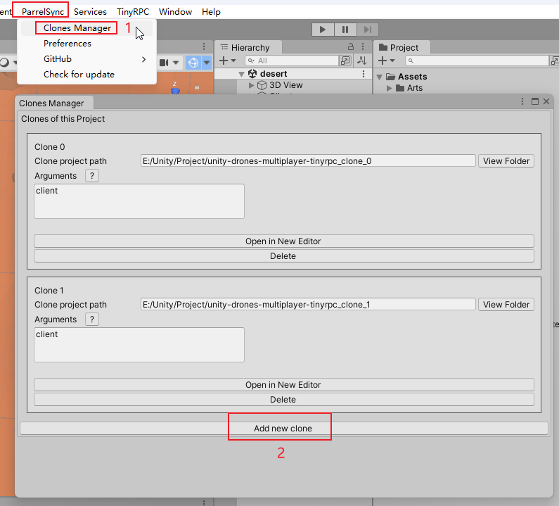

# Unity Drones Multiplayer

这是一个简单的多人游戏示例，演示了如何通过 TinyRPC 完成一个可以互相看到对方操控无人机的简单多人游戏。

A sample project to use TinyRPC  between client and server to allow multiplayer support for Unity by enabling multiple users to connect and control a drone while watching other players interact with their own drones.

# Execution on Windows

* Open main folder in Unity, open `File > Build Settings`.
* Build `Scenes/desert` into `./Build/Desert/start.exe`.
* Build `Scenes/server` into `./Build/Server/start.exe`.
* Run `Server/start.exe`
* Run `Desert/start.exe` multiple times
* Connect with a different username on each desert window
* Interact in one window to watch the drone fly in the others as well

You can also execute the server by opening `Scenes/server` in unity and pressing `Play`.

1. 你可以按上面描述的步骤分别打出2个包来体验

2. 你可以通过 [ParrelSync](https://github.com/VeriorPies/ParrelSync) ,直接在编辑器中运行服务器和客户端！

# 无人机操作：

WASD 控制前后左右平移

IKJL控制上升下降左右转弯

 

# # Resources

* [Unity flying drone tutorial from scratch (10 videos)](https://www.youtube.com/watch?v=3R_V4gqTs_I)
* https://github.com/Bian-Sh/TinyRPC
  
  [GitHub - morsh/unity-drones-multiplayer](https://github.com/morsh/unity-drones-multiplayer)
  
  
  
  
  
  License

MIT License